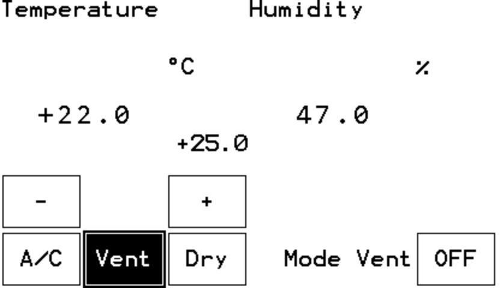
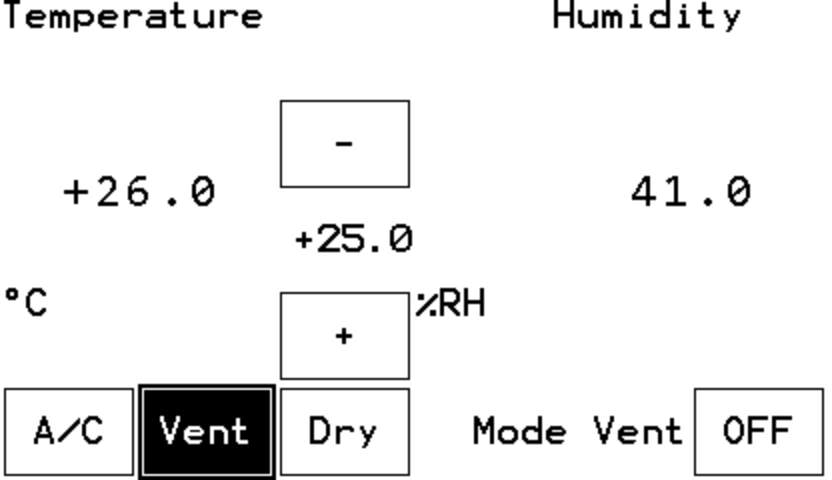

# PDI_EdgeComputing

Self-contained remote control with built-in sensors

## Configuration

**Hardware**

+ [Seeed Xiao ESP32-C3](https://www.seeedstudio.com/Seeed-XIAO-ESP32C3-p-5431.html)
+ [Seeed Xiao Grove shield](https://www.seeedstudio.com/Grove-Shield-for-Seeeduino-XIAO-p-4621.html)
+ [Seeed Grove BME280](https://www.seeedstudio.com/Grove-BME280-Environmental-Sensor-Temperature-Humidity-Barometer.html)
+ [Pervasive Displays EXT3-1 + EXT3-Touch](https://www.pervasivedisplays.com/product/touch-expansion-board-ext3-touch/)
+ [Pervasive Displays iTC EPD 3.7"-Touch](https://www.pervasivedisplays.com/product/3-7-e-ink-display-with-touch-panel/)

**Software**

+ [Arduino IDE 2.0.x](https://github.com/arduino/arduino-ide)
+ [Boards package ESP32](https://github.com/espressif/arduino-esp32)
+ [PDLS_EXT3_Basic_Touch](https://github.com/rei-vilo/PDLS_EXT3_Basic_Touch) release `6.0.5` or later
+ [SensorsWeather_Library](https://github.com/rei-vilo/SensorsWeather_Library)

## Options

Two layouts

## Results

**Bugs**

 As per this [thread](https://forum.seeedstudio.com/t/xiao-esp32-c3-and-xiao-grove-shield-compatiblity/266491), the Seeed Xiao Grove shield may not power the Seeed Xiao ESP32-C3 correctly.

## Licence

Author: &copy; Rei Vilo, 2022-2023

Licence: CC BY-NC-SA 4.0

Attribution-NonCommercial-ShareAlike 4.0 International

https://creativecommons.org/licenses/by-nc-sa/4.0/
